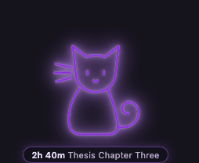
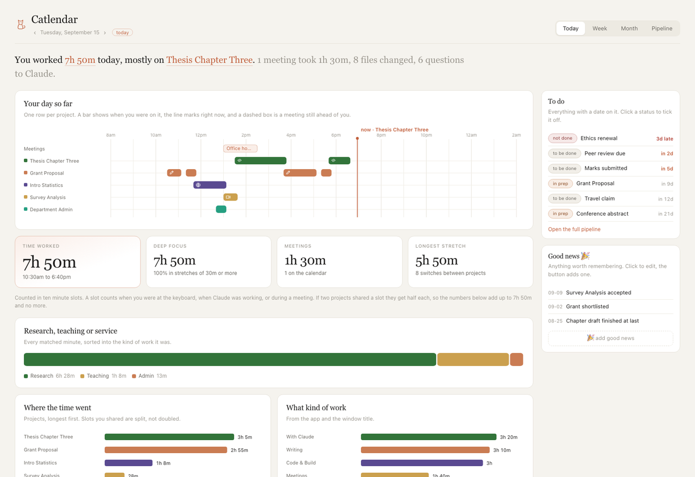
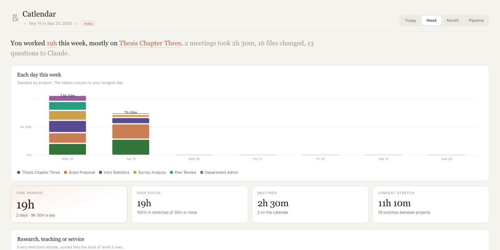
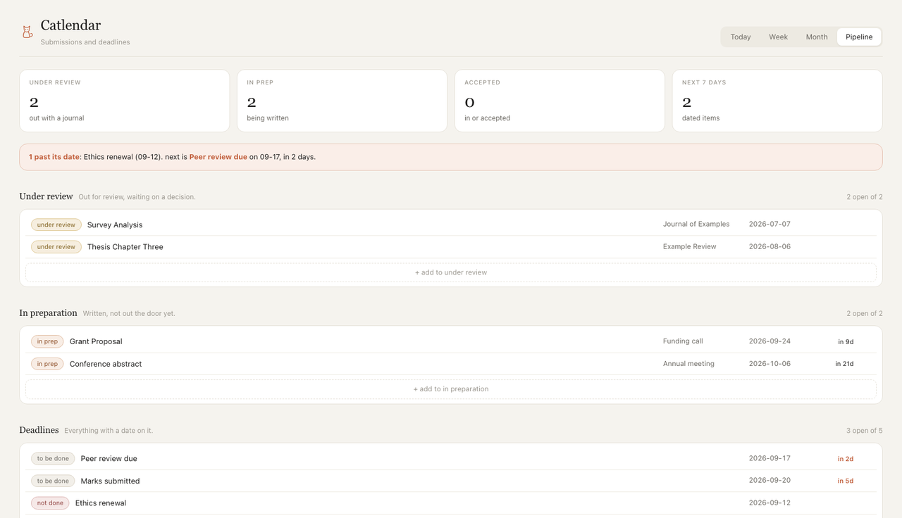

# Catlendar

A local time tracker that works out what you are working on, and puts a neon cat
on your desktop while it does.

Everything stays on your machine. There is no account, no server, and nothing
leaves the computer.

<p align="center">
  
</p>



*Every screenshot here is generated from invented data. See `scripts/demo_data.py`.*

## What makes it different

Most trackers ask you to start and stop a timer, or they log app names and leave
you to work out what "Chrome, 4 hours" meant. Catlendar tries to answer the
question you actually have, which is *which project did today go into*.

It reads three signals:

1. **The window in front**, sampled every ten seconds.
2. **What you ask Claude.** Every prompt in `~/.claude/projects` carries a working
   directory, which usually names the project outright. Claude working counts as
   you working, even while you are away from the keyboard, because it is.
3. **Files you save**, matched to the project folder they live in.

### How time is counted

Time is counted in **ten minute slots**, and the rules are deliberately strict:

- A slot counts only when there was **presence**: keyboard or mouse activity,
  Claude actually producing messages, a calendar meeting, or something you added
  by hand. A computer that is merely switched on does not count.
- **A saved file labels a slot, it never creates one.** Sync clients, backups and
  builds all touch files while you are asleep.
- **A Claude session that has finished stops counting**, because a span ends at its
  last message.
- **Sharing a slot does not multiply it.** Two projects in one slot get five
  minutes each. Per project totals add up to the clock, never more. Ten minutes
  is ten minutes.
- **A day runs 4am to 4am**, so work at 1am belongs to the night before rather
  than starting a new day. Configurable.
- **Nothing in the future counts.** A meeting on Thursday is on the calendar, not
  on the clock.

## Install

```bash
git clone https://github.com/YOUR-USERNAME/catlendar.git
cd catlendar
python3 -m venv .venv
.venv/bin/python -m pip install -r requirements.txt
```

### macOS

```bash
./scripts/build_macos.sh
open Catlendar.app
```

On first launch macOS asks for two permissions:

- **Accessibility**, for window titles. Without it everything lands in
  "Unassigned". System Settings, Privacy & Security, Accessibility.
- **Calendars**, to show meetings.

The app bundle exists for a reason worth knowing if you fork this: macOS attaches
privacy permissions to an application, and a bare Python process cannot hold
them. `launcher/launcher.c` is a small binary that stays alive and runs Python as
its child, so the permission prompts say "Catlendar" and the usage strings in
`Info.plist` are the ones you see.

Then:

```bash
./scripts/catlendar-ctl login-on     # start at login
./scripts/catlendar-ctl status
```

### Windows and Linux

The tracker and the dashboard work. The menu bar app and the desktop cat are
macOS only so far.

```bash
.venv\Scripts\python -m catlendar track     # leave this running
.venv\Scripts\python -m catlendar report    # opens the dashboard in your browser
```

Windows needs no extra packages: it reads the foreground window and the idle
timer through `user32` and `kernel32` with `ctypes`. Calendar reading is macOS
only for now, so meetings will be missing.

## Try it without waiting

To see the dashboard before you have any data of your own:

```bash
CATLENDAR_DATA_DIR=/tmp/catlendar-demo python scripts/demo_data.py
CATLENDAR_DATA_DIR=/tmp/catlendar-demo python -m catlendar report
```

That writes a month of invented work to a throwaway folder and opens it. It
refuses to touch your real data folder.

## Teaching it your projects

Open `projects.yaml` in your data folder (see below) and set `project_roots` to
the folders that hold one subfolder per project:

```yaml
  project_roots:
    - {path: "~/Documents/Research", kind: research}
    - {path: "~/Documents/Teaching", kind: teaching}
    - {path: "~/Documents/Service",  kind: service}
```

Then:

```bash
python -m catlendar scan
```

Every subfolder becomes a project, tagged with that kind, which is what drives the
research / teaching / service split on the dashboard. Add nicknames by hand and
they survive later scans:

```yaml
  - key: thesis-chapter-three
    label: "Thesis chapter three"
    kind: research
    paths: ["Research/Thesis chapter three"]
    keywords: ["chapter 3", "ch3 draft"]
```

Matching is case insensitive over `app name | window title` and over file and
prompt paths. The **longest** matching keyword wins, so a specific phrase beats a
generic one. A keyword starting with a letter or digit only matches at a word
start, so `review` does not fire inside `Preview`.

## The dashboard

Click the cat, or run `python -m catlendar report`.





- **Today**: a timeline with one row per project, a line marking now, dashed boxes
  for meetings still ahead, and arrows to walk back through any earlier day.
- **Week** and **Month**: stacked columns and a calendar heatmap.
- **Pipeline**: whatever you are tracking, with statuses (to be done, in prep,
  under review, accepted, rejected, done, not done). Editable in the page.
- **To do** and **Good news** sit beside today, both editable.
- **Add your own time** for anything the computer could not see: reading on
  paper, a phone call, a whiteboard. "also" counts it alongside what was
  detected, "instead" makes those slots count only as that.

## The cat

Every pose is tied to something the app knows:

| pose | meaning |
|---|---|
| sitting, purple, tail swaying | working |
| brighter glow, tail still | 25 minutes or more on one project |
| cyan with a call window | in a meeting |
| orange, bouncing | a meeting starts within five minutes |
| eyes shut | a few minutes without input |
| curled up asleep | five minutes untouched |
| moon beside it | late night |
| grey and still | tracking paused |

It stretches when you come back, washes its face while you work, hops when you
tick something off, and **you can feed it by double clicking**. Drag it anywhere.
`Control Option C` hides and shows it.

By default the cat lives **on the desktop**, so any window covers it: a document,
a browser, a slideshow, full screen or merely maximized. You see it when you can
see your desktop, and never over what you are presenting. If you would rather it
floated above everything, there is "Keep cat on top" in its menu, or set
`cat_layer: floating`.

The one exception is the **five minute meeting warning**: for that the cat lifts
above every window, turns orange and counts down, then drops back to the desktop.
A warning you cannot see is not a warning.

## Asking it things

There is an **Ask** box beside your day. It answers questions about your own
tracked time, and can propose changes.

```
how long on the grant this week?
which day was my longest?
add 40 minutes to the thesis from 2pm
mark the peer review as done
```

It never makes a change on its own. When you ask for one it proposes it, the
dashboard shows a **do it** button, and nothing happens until you click. It can
add time, add good news, add a to do, and change an item's status. It cannot
touch your real calendar.

It needs a model, and looks for one in this order:

1. The [`claude`](https://claude.com/claude-code) command line tool, if it is
   installed and signed in. Nothing to configure. If it has been a while, run
   `claude` once in a terminal to sign in again.
2. `ANTHROPIC_API_KEY` in your environment, which uses the API directly.

Only the summary numbers go to the model: totals per project, your open items,
the day's meetings by title. Window titles, file names and prompt text stay on
your machine. If no model is set up the box says so and everything else works as
before.

## Privacy

Window titles can contain anything, so:

```yaml
privacy:
  redact_title_contains: [1password, keychain, incognito]
  redact_apps: [1Password, Messages]
```

A redacted title is stored as `(private)`: the time still counts, the text does
not. Pausing from the menu stops recording entirely.

Your data lives in one folder, and nothing else reads it:

- macOS `~/Library/Application Support/Catlendar/`
- Windows `%APPDATA%\Catlendar\`
- Linux `~/.local/share/catlendar/`

It holds `catlendar.db` (about a megabyte a month), your `projects.yaml`,
`pipeline.yaml` and `goodnews.yaml`, and logs. Delete the folder and Catlendar
forgets everything.

## Layout

```
catlendar/tracker.py        samples the front window
catlendar/platform_mac.py   window titles, idle, full screen, on macOS
catlendar/platform_win.py   the same through ctypes, on Windows
catlendar/sources.py        Claude sessions and saved files
catlendar/config.py         projects.yaml into (project, activity)
catlendar/report.py         slots into the dashboard numbers
catlendar/dashboard.py      numbers into HTML
catlendar/ui.py             cat window, dashboard window, menu bar (macOS)
catlendar/app.py            the macOS app
catlendar/__main__.py       the command line, every platform
assets/cat.html             the cat
assets/dashboard.html       the dashboard
launcher/launcher.c         the tiny binary that owns the macOS permissions
```

## Contributing

The obvious gaps, if you want something to do:

- A desktop cat for Windows and Linux.
- Calendar reading outside macOS.
- A packaged installer so people do not need a terminal.

## License

MIT.
